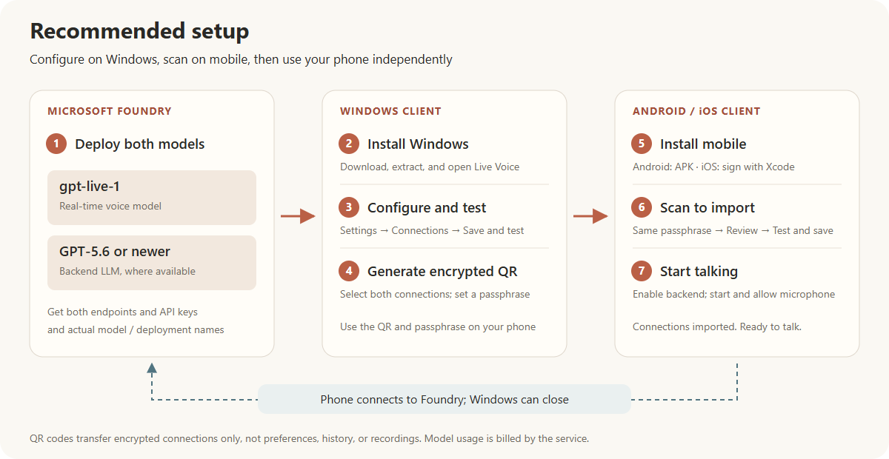
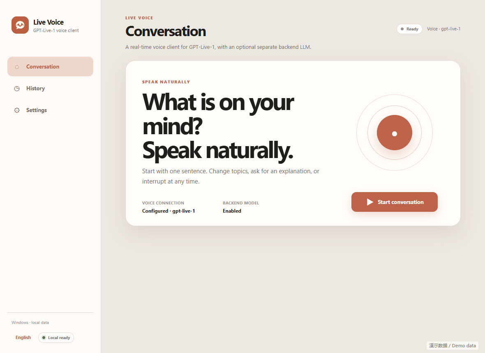
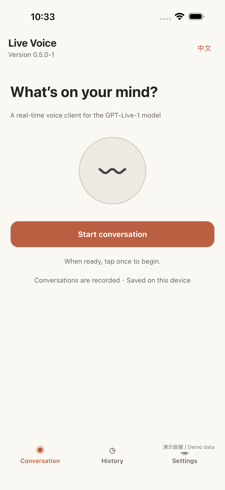
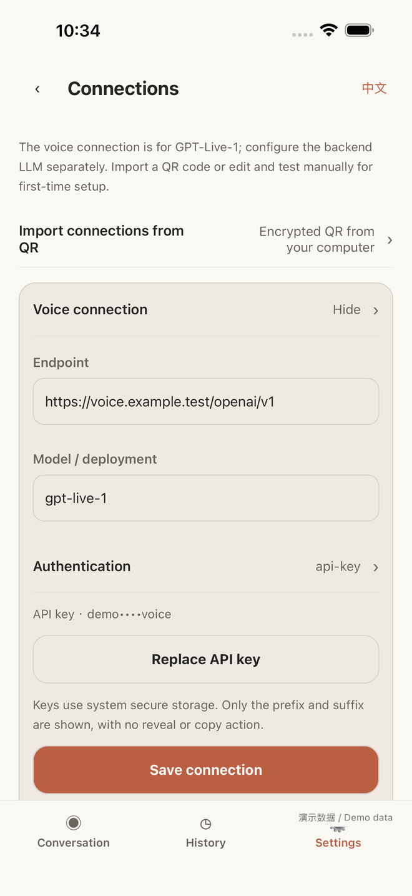

# Live Voice — A GPT-Live-1 voice client

[简体中文](README.md) | **English**

Live Voice is an Android, iOS, and Windows client for the **GPT-Live-1 real-time voice model**, with natural conversation and interruption. The voice connection must use a service implementing the GPT-Live-1 protocol. A separate backend LLM handles reasoning and web search; GPT-5.6 or newer is recommended.

## Downloads

**[One release page for Windows and mobile](https://github.com/kylefu8/live-voice-app/releases/latest)**

| Platform | Current version | Installation |
| --- | --- | --- |
| Windows (PC) | 0.2.0-2 | [Download ZIP](https://github.com/kylefu8/live-voice-app/releases/download/mobile-v0.5.0-2/live-voice-windows-0.2.0-2-x64.zip), extract the entire folder, and run `Live Voice.exe` |
| Android | 0.5.0-2 | [Download APK](https://github.com/kylefu8/live-voice-app/releases/download/mobile-v0.5.0-2/live-voice-android-0.5.0-2-arm64-v8a.apk); see the [signing transition](docs/SIGNING-TRANSITION.en.md) for internal test builds |
| iOS | 0.5.0-2 | Sign and install using a Mac and Xcode: [iOS setup](native/IOS.en.md). No App Store or TestFlight download is currently available |

See [download instructions](docs/DOWNLOADS.en.md) for installation, platform differences, and checksum verification. Earlier internal builds are not offered as public downloads.

## Recommended setup

[View the full-size diagram](docs/images/recommended-setup-en.png)

1. **Deploy models:** deploy `gpt-live-1` and a backend LLM (GPT-5.6 or newer recommended) in Microsoft Foundry. Obtain each endpoint, API key, and actual deployment name. Availability depends on your project, region, and access eligibility.
2. **Install Windows:** download and fully extract the PC ZIP, then run `Live Voice.exe`.
3. **Configure connections:** open **Settings → Connections**, configure the voice and backend separately, save, and test each. Enable the backend in conversation settings.
4. **Generate a QR code:** open **Connections → Generate configuration QR**, select both saved connections, and enter and confirm an import passphrase of at least four characters.
5. **Install mobile:** install the Android APK, or sign and install the iOS app using Xcode.
6. **Import on mobile:** open **Settings → Connections → Import connections from QR**, enter the same passphrase, review, and **Test and save**. Enable the backend separately under **Conversation settings → Backend reasoning**.
7. **Start talking:** return home, select **Start conversation**, and allow microphone access. The phone connects directly to the models; Windows can be closed.

[Detailed steps, connection fields, and troubleshooting](docs/GETTING_STARTED.en.md)

## Screenshots

These screenshots use the actual interface code with synthetic demonstration data. They contain no personal device details, real connections, credentials, or conversations. They illustrate the UI, not a verified live model response.

**Windows**

**Mobile**

  
  

[All screenshots: preferences, model connections, backend settings, history, and QR linking](docs/SCREENSHOTS.en.md)

## Features

| Feature | Mobile | Windows |
| --- | --- | --- |
| GPT-Live-1 voice conversation, interruption, captions | Supported | Supported |
| Separate backend LLM, web search, collapsible sources | Supported when the service supports it | Supported when the service supports it |
| Chinese/English UI; light/dark/system appearance | Supported | Supported |
| Separate voice/backend configuration, tests, masked keys | Supported | Supported |
| Encrypted QR linking | Camera import | Generate and save QR codes |
| In-call preference updates | Supported settings save/apply automatically | Save to apply supported settings |
| Rename/delete history; backend-generated titles | Supported | Supported |
| Recording both sides and local playback | Supported; can be disabled | Text history only at present |
| Audio devices | System communication routing | Select and test input/output devices |

Settings that cannot change live are disabled during a call. Actual tone and intonation depend on the service; an update acknowledgment does not verify every audible effect. Model usage is billed by the configured service.

## Data and licensing

Mobile and Windows connect directly to model services and keep separate local histories. QR codes transfer encrypted connections only, not preferences, history, or recordings. API keys use system secure storage and are only shown as masked prefixes/suffixes.

Personal study and noncommercial use/modification are free under the custom [noncommercial license](LICENSE). **All commercial use and commercial development require prior written authorization from kylefu8**, with fees agreed separately. This is source-available software; third-party components retain their own licenses. See [commercial licensing](COMMERCIAL-LICENSING.en.md).

## Documentation and source

- [Getting started](docs/GETTING_STARTED.en.md) · [Screenshots](docs/SCREENSHOTS.en.md) · [Downloads](docs/DOWNLOADS.en.md)
- [Android / iOS](native/README.en.md) · [Windows](desktop/README.en.md) · [iOS installation](native/IOS.en.md)
- `native/`: mobile; `desktop/`: Windows; `pc-config/`: standalone QR web tool; `prototype/`: early interaction prototype.
- Platform directories, `design/`, and `docs/adr/` contain development and historical design material. Local configuration, build caches, diagnostics, private screenshots, and recordings are not committed.
