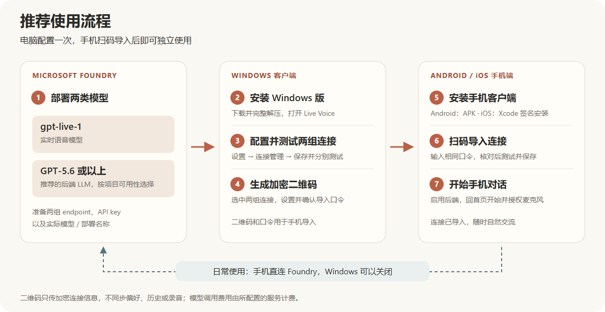

# 首次使用指南

**简体中文** | [English](GETTING_STARTED.en.md)

Live Voice 是专为 **GPT-Live-1 实时语音模型**使用的客户端，后端 LLM 是独立的推理服务。[下载所有平台](DOWNLOADS.md) · [查看界面截图](SCREENSHOTS.md)

推荐从 **Foundry 部署 → Windows 配置和测试 → 二维码导入手机** 开始。Windows 客户端也可以独立进行语音对话，但不充当手机的服务端。

## 1. 在 Microsoft Foundry 部署两个模型

进入 [Microsoft Foundry](https://ai.azure.com/)，在自己的项目中准备两组模型服务：

| 用途 | 建议模型 | 在 Live Voice 中填写 |
| --- | --- | --- |
| 实时语音、听说和打断 | `gpt-live-1` | 语音模型连接 |
| 后端推理与联网搜索 | GPT-5.6 或以上 | 后端模型连接 |

这是本项目推荐的组合，不代表每个地区、订阅或项目都有这些模型。以 Foundry 项目的模型目录、访问资格和配额为准；若没有对应模型，先解决模型访问问题。后端需支持应用使用的 Responses 接口；联网搜索还取决于模型及服务是否支持相应工具。

部署完成后，为每组连接准备 **endpoint、API key、实际部署名称、鉴权方式**。模型栏应填写服务可接受的模型或部署标识：如果自定义了部署名称，使用该部署名称，而非照抄目录显示名称。部署和资源管理参考 [Microsoft Foundry 官方文档](https://learn.microsoft.com/en-us/azure/foundry/)。

## 2. 安装 Windows 版

从 [统一发布页](https://github.com/kylefu8/live-voice-app/releases/latest) 下载 `live-voice-windows-0.2.0-1-x64.zip`，完整解压后运行 `Live Voice.exe`。同目录的运行文件必须保留，无需另装 Node.js。

## 3. 配置并测试模型连接

在 **设置 → 连接管理** 中，分别打开 **语音模型连接**与**后端模型连接**，填写上一步记录的信息，然后点击 **保存连接**、**测试连接**。

- endpoint 填服务 API 基址，不是 Foundry 管理页面地址。官方 Azure OpenAI 资源根地址会由应用补全 `/openai/v1`；自定义网关请提供正确的 API 基址。
- endpoint 和 API key 分开填写；鉴权方式以服务要求为准。不要将 key 拼在 URL 中。
- 两组连接分别管理，可以使用不同资源、地址与 key。界面保存后只显示 key 的头尾遮罩。
- 在 **对话设置**中启用后端模型。建议从默认的最大输出 **32768** 和联网搜索开启开始，推理强度根据响应速度与回答质量调整。

连接测试会发起真实请求，可能产生模型用量。测试成功说明当次连接和请求通过，不代替实际听说或联网搜索体验测试。

## 4. 生成配置二维码

打开 **设置 → 连接管理 → 生成配置二维码**，选中已保存的语音与后端连接，输入并确认导入口令后生成二维码。可以让手机直接扫描电脑屏幕，也可以保存 QR 图片。

导入口令至少 4 位，建议使用较长、自己能记住的口令。二维码内容经过加密，口令不包含在二维码内；将二维码与口令一起转给别人，就相当于分享其中的连接凭据。

## 5. 安装手机端

- **Android：**从 [统一发布页](https://github.com/kylefu8/live-voice-app/releases/latest) 下载 `live-voice-android-0.5.0-1-arm64-v8a.apk`，在兼容的手机上安装。已有版本可覆盖升级。
- **iOS：**目前使用 Mac/Xcode 签名安装，尚无 App Store 或 TestFlight 下载。普通 Apple ID 的 Personal Team 可用于自己的设备测试，操作与签名限制见 [iOS 说明](../native/IOS.md)。

## 6. 手机扫码导入并测试

在手机打开 **设置 → 连接管理 → 扫码导入连接**，授予相机权限并扫描电脑上的二维码。输入生成时设置的同一口令，核对地址、模型和密钥遮罩，选中两组连接，点击 **测试并保存**。

只有全部选中的连接测试通过后才保存。电脑和手机的网络可能不同；电脑能连接不代表手机一定能连接。

二维码只导入模型连接，不同步对话偏好、后端启用开关、历史或录音。导入后，到手机 **设置 → 对话设置 → 后端推理参数**中开启**启用后端**，并按需要确认联网搜索、推理强度和输出长度。

## 7. 手机开始对话

返回首页，点击 **开始对话**，授予麦克风权限后自然说话。对话中可以随时打断，或进入对话设置修改当前支持实时更新的选项。

日常对话由手机直接连接模型服务，Windows 可以关闭。两端的历史和录音分别保留在各自设备；不会通过二维码同步。模型调用费用由你的 Azure 订阅或所配置服务承担，与 Live Voice 的软件授权费用分开。

## 常见问题

| 情况 | 检查方式 |
| --- | --- |
| Foundry 没有目标模型 | 检查订阅、地区、访问资格和配额；不要把相近模型当作 `gpt-live-1` 的直接替代。 |
| 测试提示接口不存在 | 检查 endpoint 是否为 API 基址、路径是否完整，以及部署名称是否正确。 |
| 二维码口令错误 | 输入生成该二维码时的原口令；重新生成的新口令不能解开旧二维码。 |
| 导入成功但没有调用后端 | 导入不启用后端开关；在手机的后端推理参数中开启。是否实际调用后端还取决于当轮对话。 |
| 电脑测试通过，手机失败 | 检查手机网络能否访问同一服务，以及服务的网络访问限制。 |
