# Screenshots

[简体中文](SCREENSHOTS.md) | **English**

These images use the actual mobile UI and Windows renderer with synthetic data. No personal devices, real endpoints, keys, or conversations are shown. The demo watermark identifies the isolated screenshot environment; screenshots do not prove real-provider audio behavior.

[Home](../README.en.md) · [Getting started](GETTING_STARTED.en.md) · [Downloads](DOWNLOADS.en.md)

## Mobile

<table>
<tr><th>Home</th><th>Settings</th><th>Connections</th></tr>
<tr><td></td><td><a href="images/screenshots/mobile-settings-en.png">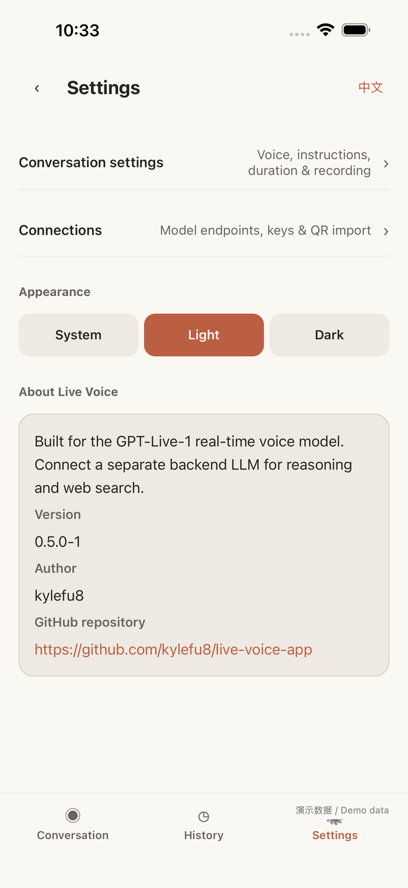</a></td><td></td></tr>
<tr><th>Conversation settings</th><th>Backend reasoning</th><th>History</th></tr>
<tr><td><a href="images/screenshots/mobile-preferences-en.png">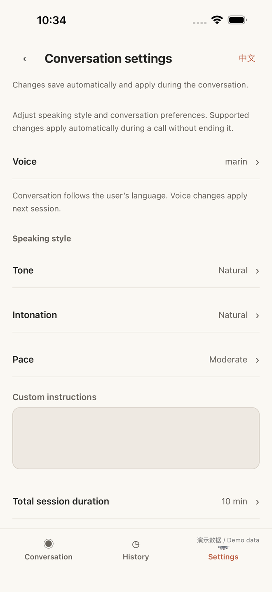</a></td><td><a href="images/screenshots/mobile-backend-en.png">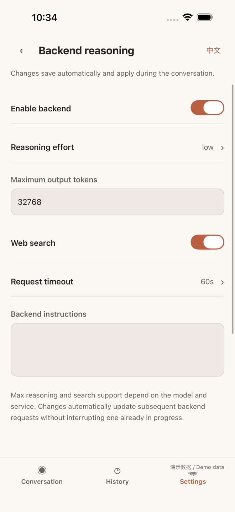</a></td><td><a href="images/screenshots/mobile-history-en.png">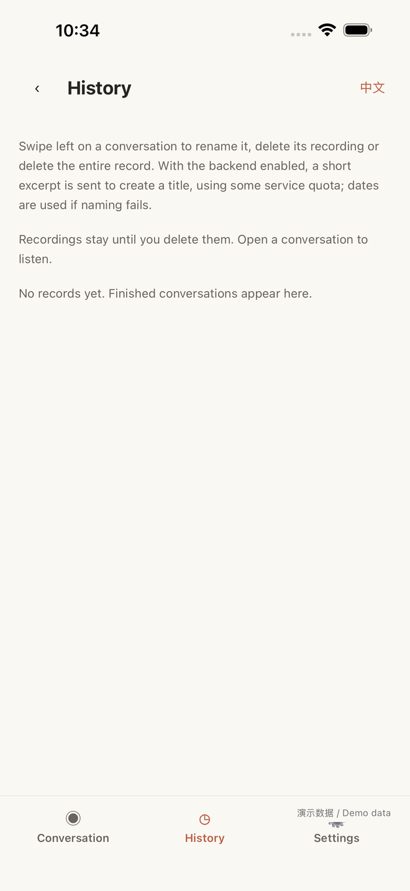</a></td></tr>
</table>

## Windows

Home

Conversation settings

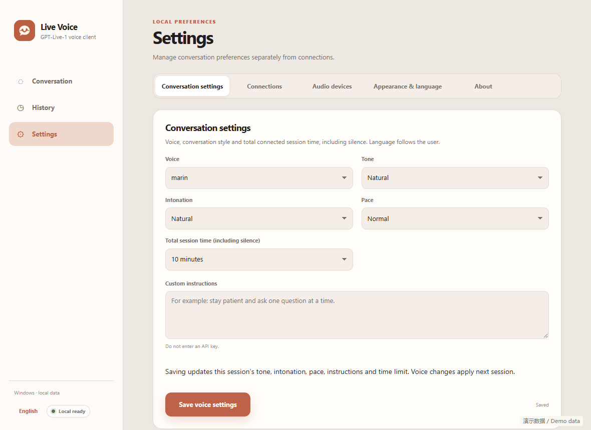

Model connections

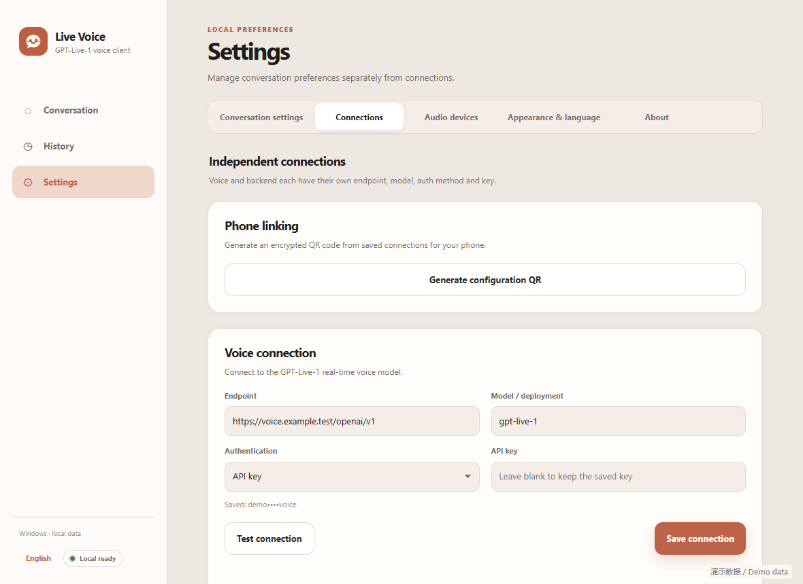

QR linking

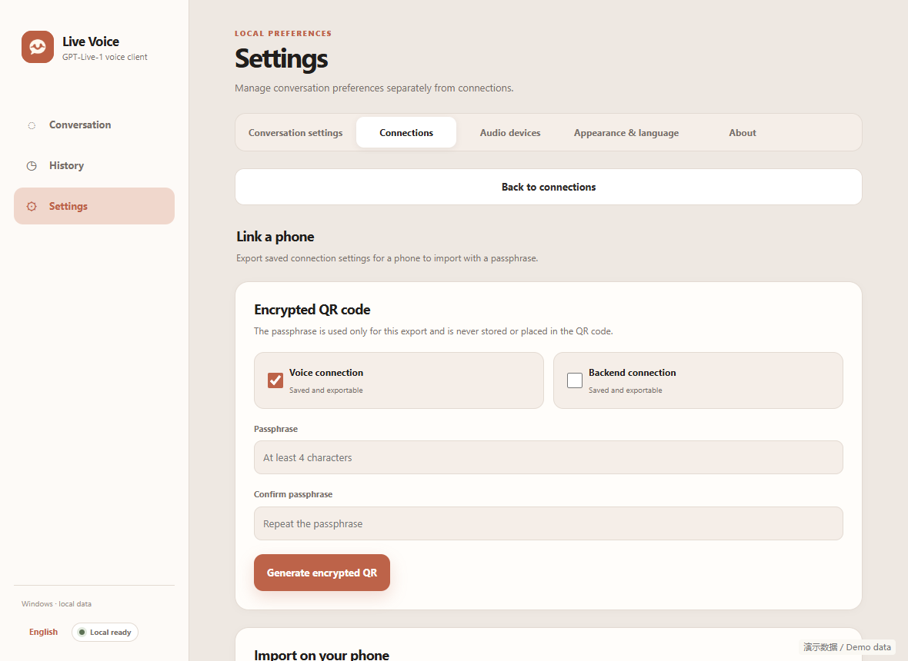

Audio devices

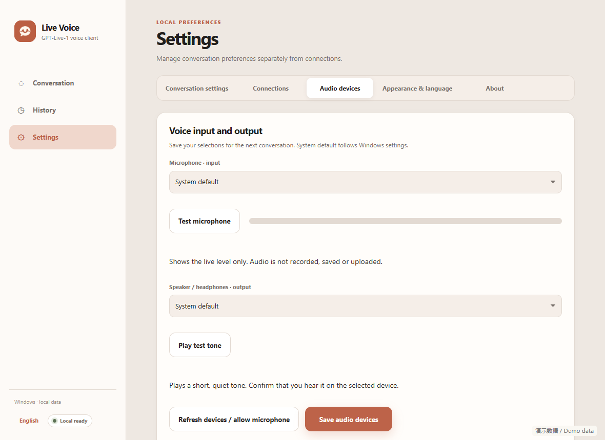

Appearance and language

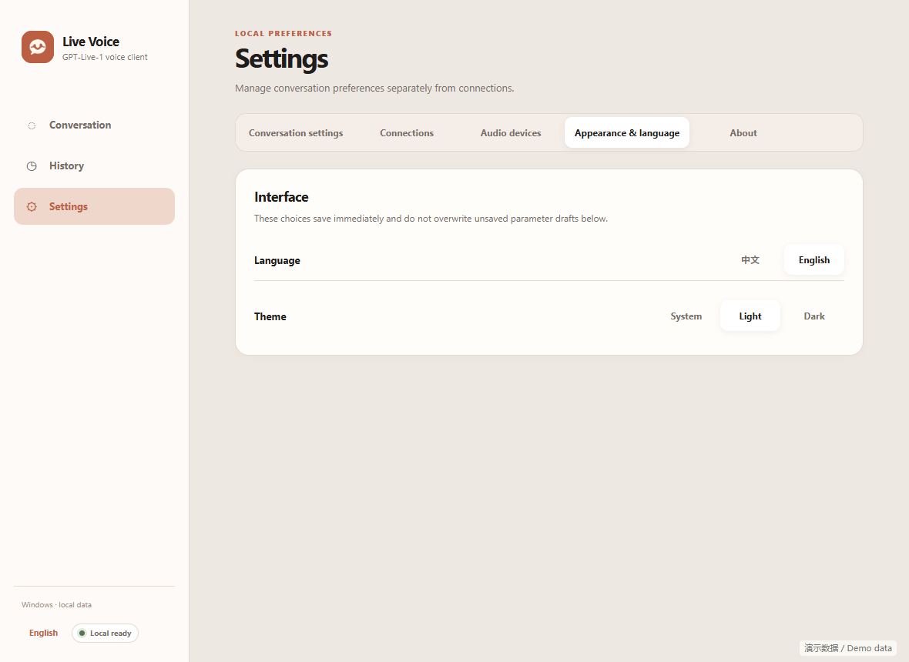

About

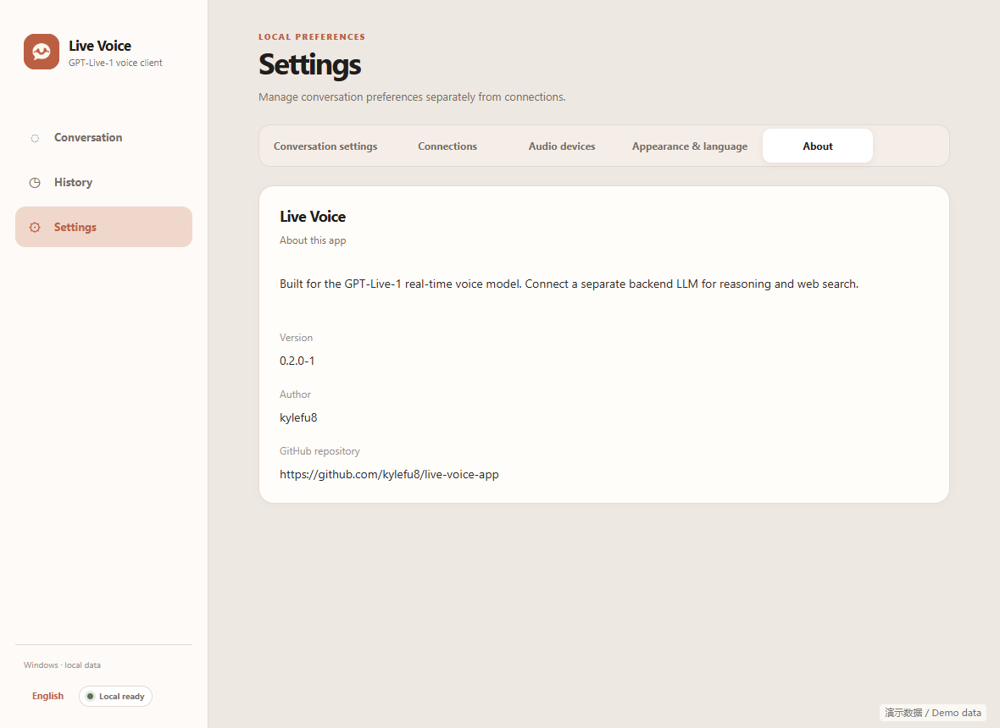

History

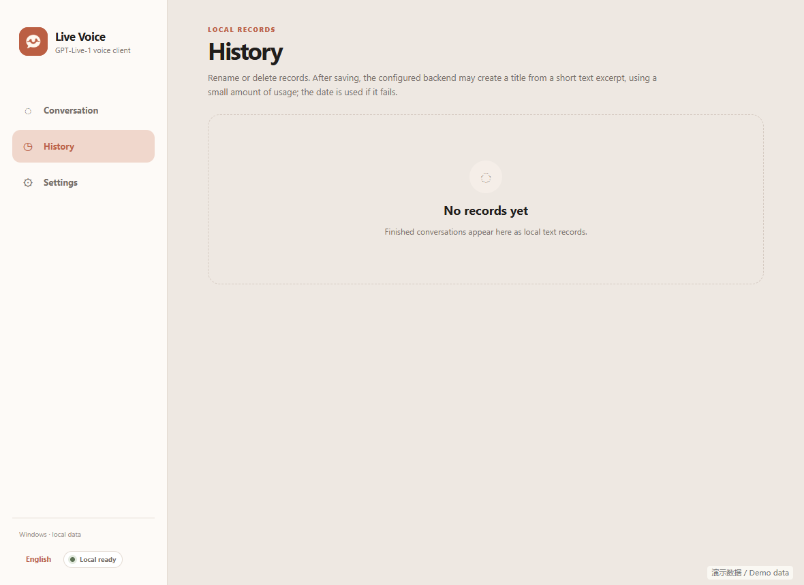

