# 界面截图

**简体中文** | [English](SCREENSHOTS.en.md)

截图使用实际手机界面及 Windows 界面代码，全部为演示数据，不含私人设备信息、真实地址、密钥或会话。“演示数据”角标用于标识隔离截图环境；截图不代表真实服务的音频验收。

[项目首页](../README.md) · [使用指南](GETTING_STARTED.md) · [下载](DOWNLOADS.md)

## 手机端

<table>
<tr><th>首页</th><th>设置</th><th>连接管理</th></tr>
<tr><td><a href="images/screenshots/mobile-home-zh.png">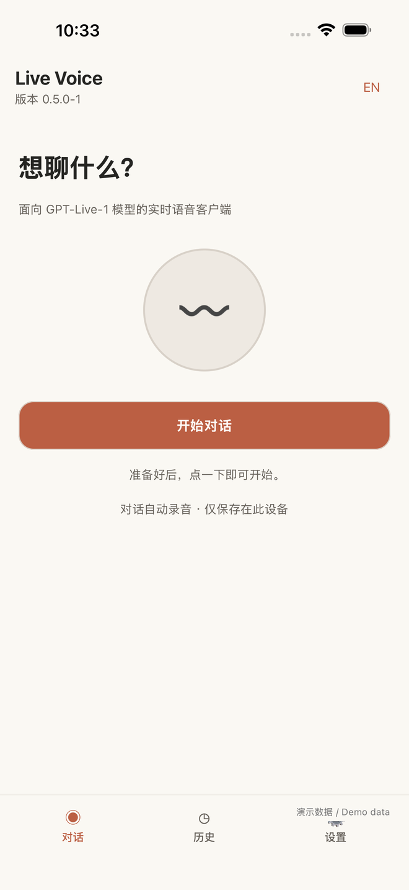</a></td><td><a href="images/screenshots/mobile-settings-zh.png">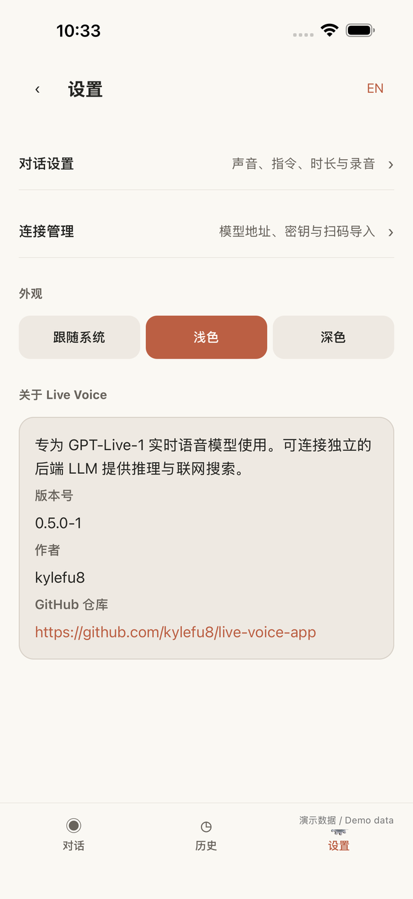</a></td><td><a href="images/screenshots/mobile-connections-zh.png">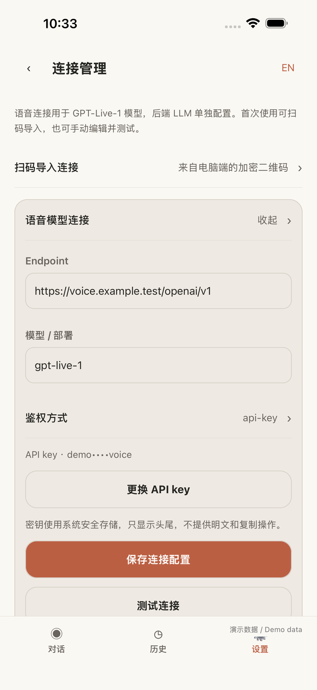</a></td></tr>
<tr><th>对话设置</th><th>后端参数</th><th>历史</th></tr>
<tr><td><a href="images/screenshots/mobile-preferences-zh.png">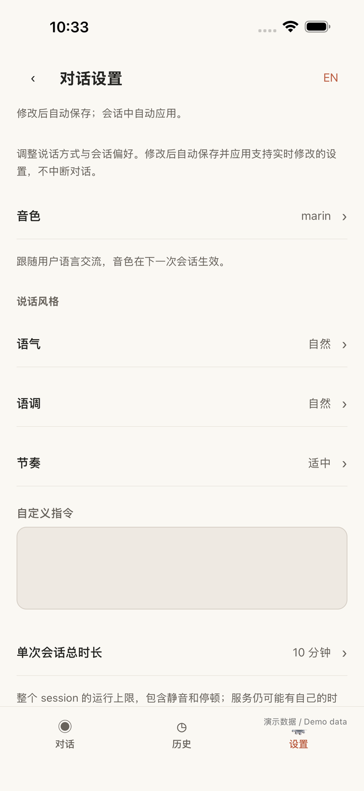</a></td><td><a href="images/screenshots/mobile-backend-zh.png">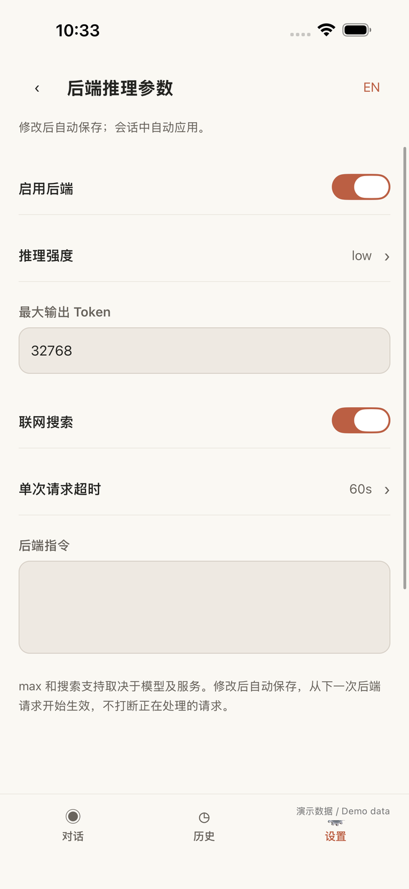</a></td><td><a href="images/screenshots/mobile-history-zh.png">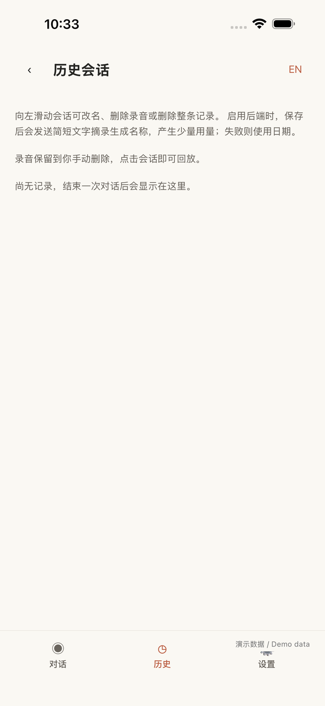</a></td></tr>
</table>

## Windows

首页

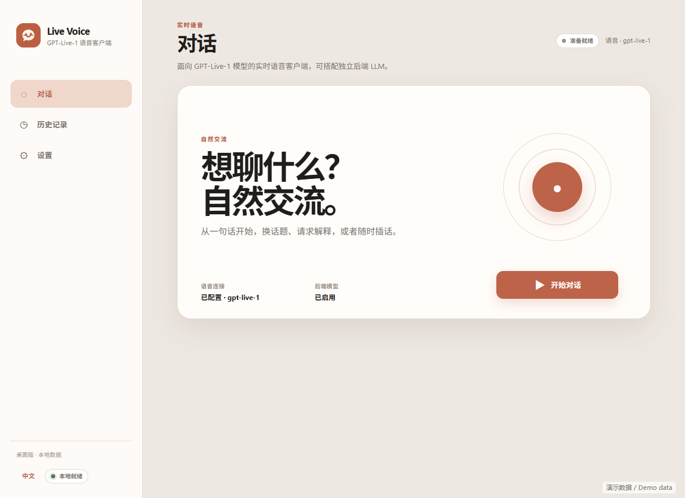

对话设置

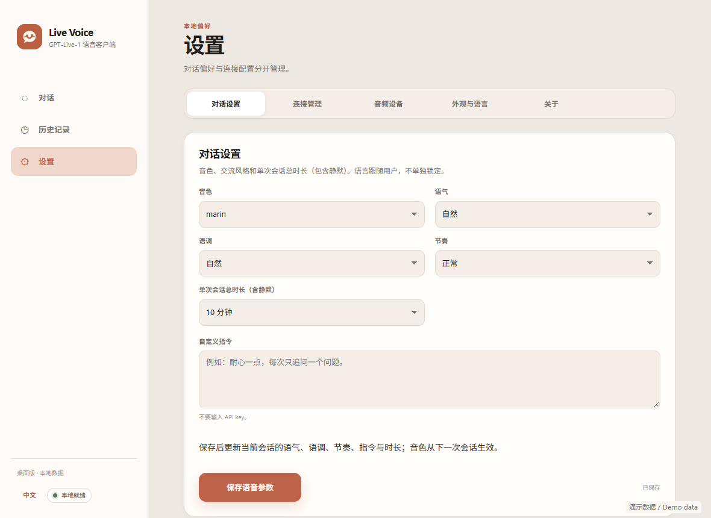

模型连接

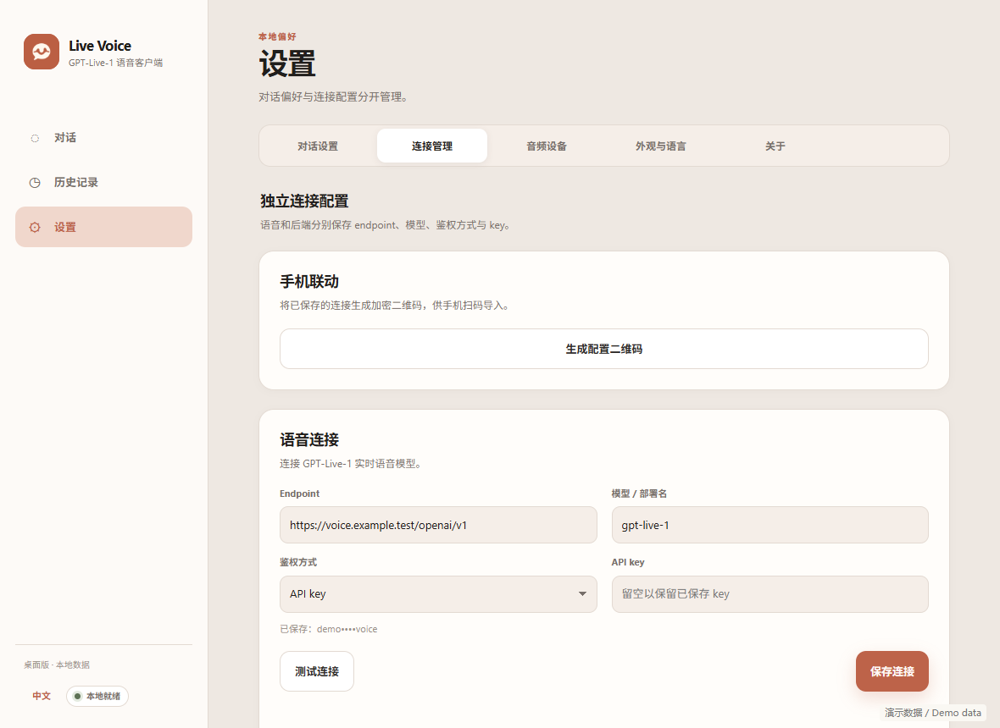

二维码联动

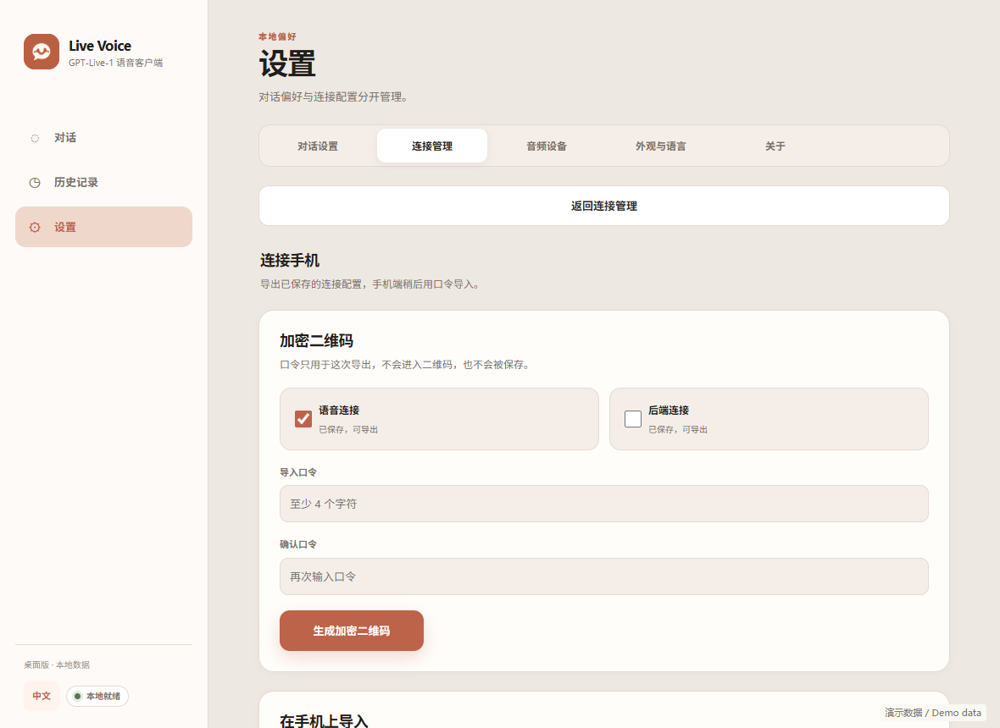

音频设备

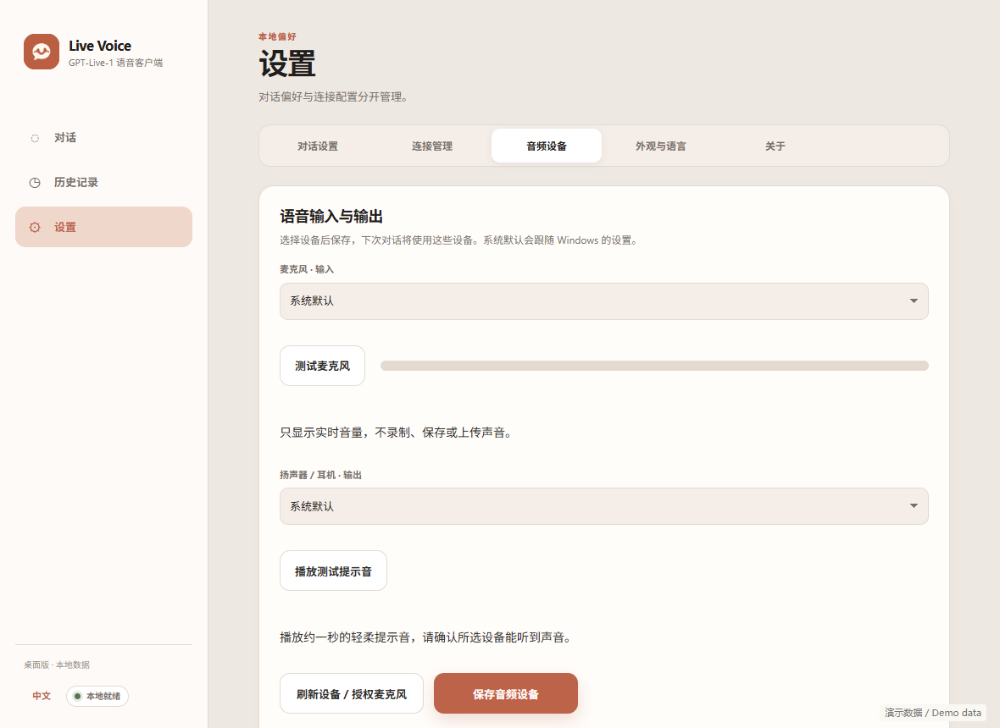

外观与语言

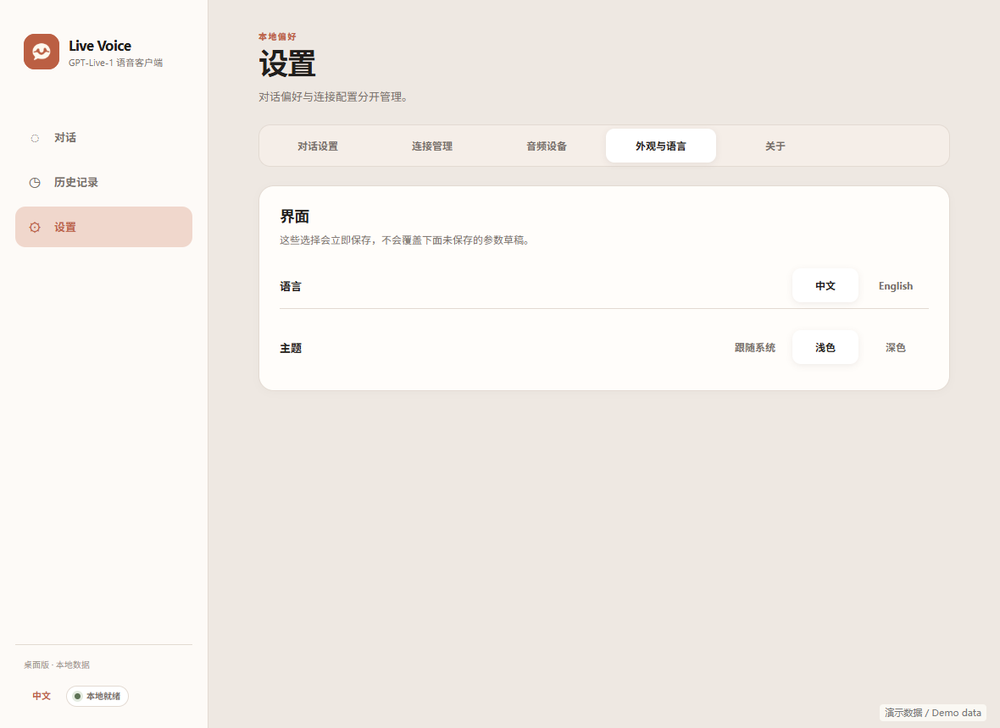

关于

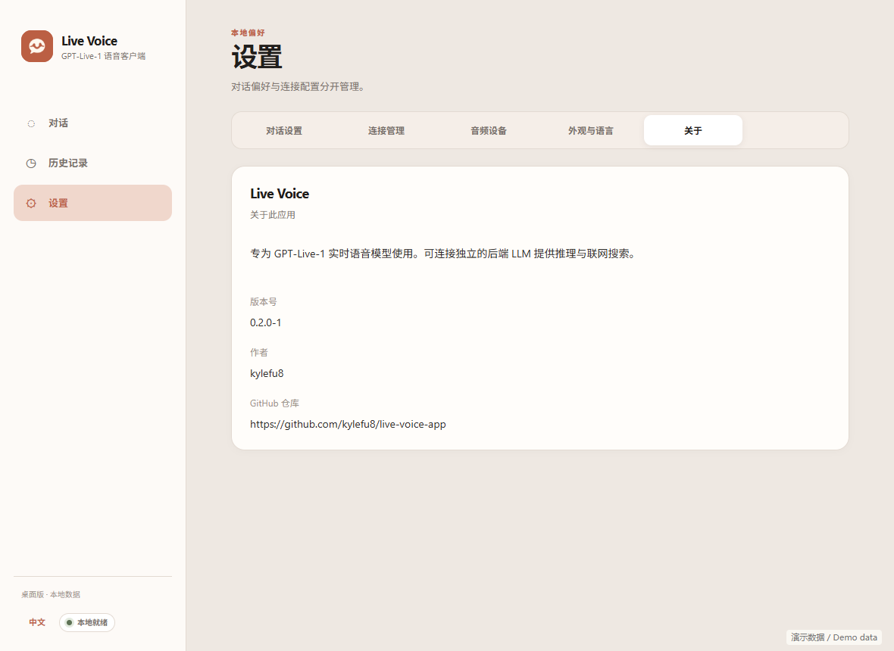

历史

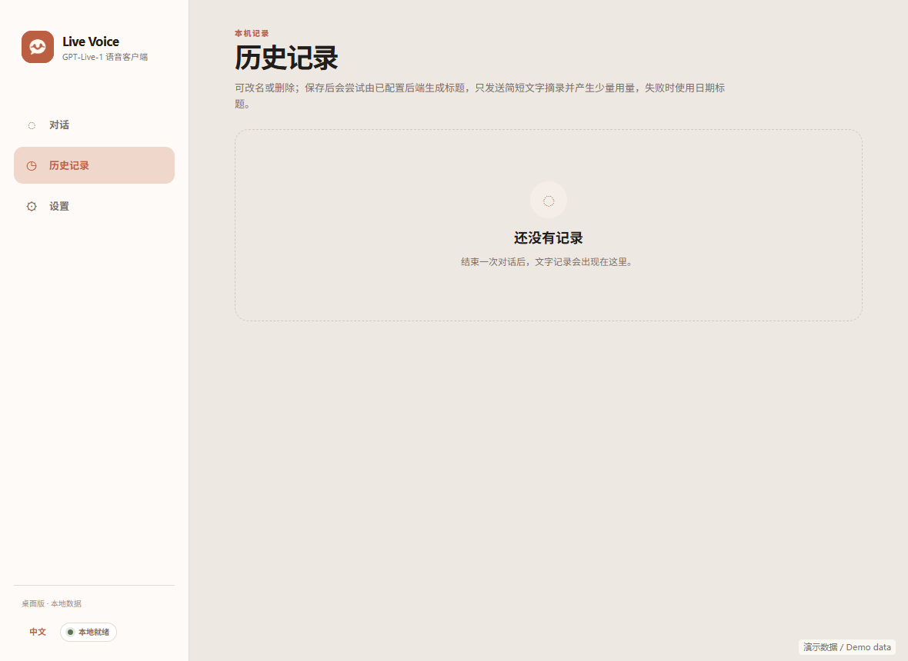

